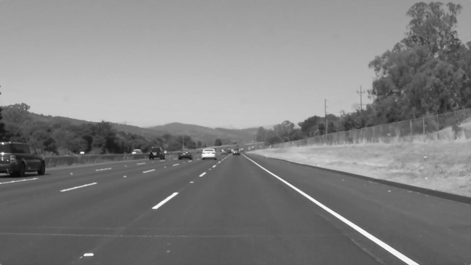
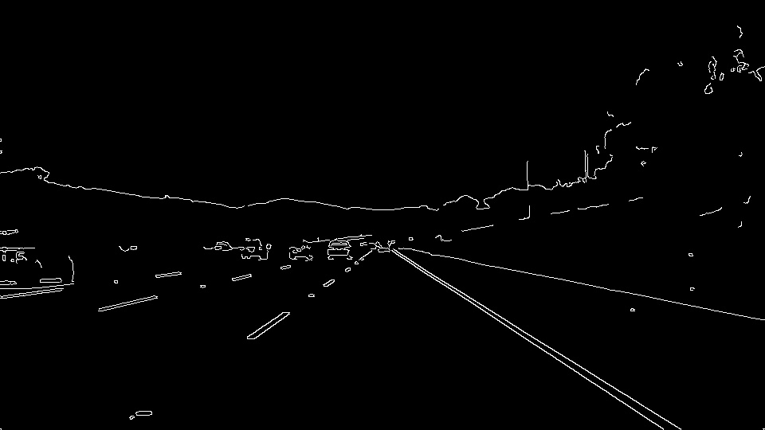
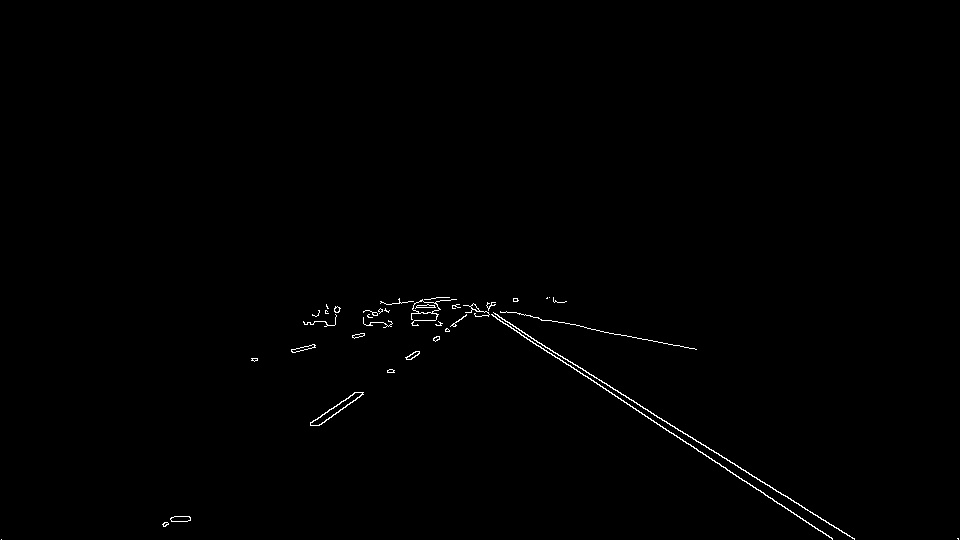
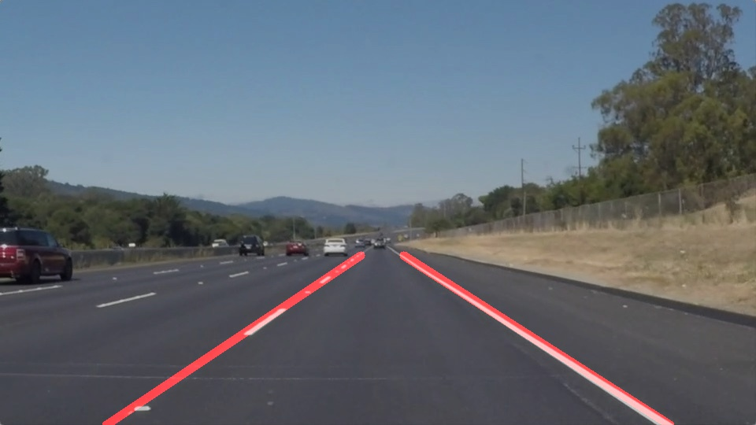

# **Finding Lane Lines on the Road** 

## Writeup Template

### You can use this file as a template for your writeup if you want to submit it as a markdown file. But feel free to use some other method and submit a pdf if you prefer.

---

**Finding Lane Lines on the Road**

### Reflection

### 1. Describe your pipeline. As part of the description, explain how you modified the draw_lines() function.

My pipeline consisted of 5 steps. 
Original image)
 

1st step) I converted the images to grayscale for the following processing.
 

2nd step) Grayscale image was made smooth by Gaussian smoothing.
 

3rd step) Canny edge detection was applied to smoothed gray image.
 

4th step) Masking the image of edge via the trapezoidal window to extract area of lane-line.
Position of each vertices were tweaked for better line detection.
 

5th step) Hough transformation and drawing lines.
In order to draw a single line on the left and right lines, I separated the output of "cv2.HoughLinesP" into two groups.
If the slope of line is positive, then that is right line. If the slope is negative, then left line.
Addtionally, I set allowable range of values for each slope, in order to exclude noise.
 

### 2. Identify potential shortcomings with your current pipeline

Shortcomings)
In the middle of "challenge.mp4", left lines cannot be detected for short period. 

### 3. Suggest possible improvements to your pipeline

A possible improvement would be to tweak parameters of gaussian, canny and hough transform.

